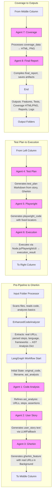

```mermaid
flowchart LR
    subgraph Column1 [Pre-Pipeline to Gherkin]
        direction TB
        A[Input Folder Processor] -->|Scans files, reads code, analyzes basics| B[EnhancedCodeAnalyzer]
        B -->|Extracts: real URLs, parsed steps, language, frameworks → AST Analysis Dict| C[LangGraph Workflow Start]
        C -->|Initial State: original_code, filename, ast_analysis| D[Agent 1: Code Analysis]
        D -->|Refines ast_analysis: URLs, steps, assertions| E[Agent 2: User Story]
        E -->|Generates user_story text via LLM/Fallback| F[Agent 3: Gherkin]
        F -->|Generates gherkin_feature with real URLs in Background| Cont1[To Middle Column]
    end
    
    subgraph Column2 [Test Plan to Execution]
        direction TB
        Cont1Mid[From Left Column] --> G[Agent 4: Test Plan]
        G -->|Generates test_plan Markdown from story, Gherkin| H[Agent 5: Playwright]
        H -->|Generates playwright_code with fixed locators| I[Agent 6: Execution]
        I -->|Executes via Node.js/Playwright/c8 → execution_result| Cont2[To Right Column]
    end
    
    subgraph Column3 [Coverage to Outputs]
        direction TB
        Cont2Right[From Middle Column] --> J[Agent 7: Coverage]
        J -->|Processes coverage_data → HTML, PNG| K[Agent 8: Final Report]
        K -->|Compiles final_report, saves artifacts| L[End]
        L -->|Outputs: Features, Tests, Coverage HTML/PNG, Reports, Logs| M[Output Folders]
    end
    
    style D fill:#f9f,stroke:#333
    style E fill:#f9f,stroke:#333
    style F fill:#f9f,stroke:#333
    style G fill:#f9f,stroke:#333
    style H fill:#f9f,stroke:#333
    style I fill:#f9f,stroke:#333
    style J fill:#f9f,stroke:#333
    style K fill:#f9f,stroke:#333
    
    %% Additional Information
    %% State: Shared via TypedDict, errors accumulated, timestamped
    %% LLM: Prompt templates for generation, fallback if no API
    %% Execution: Subprocess calls to Node.js for Playwright/c8
    %% Visuals: Matplotlib for PNG, HTML templates for reports
```